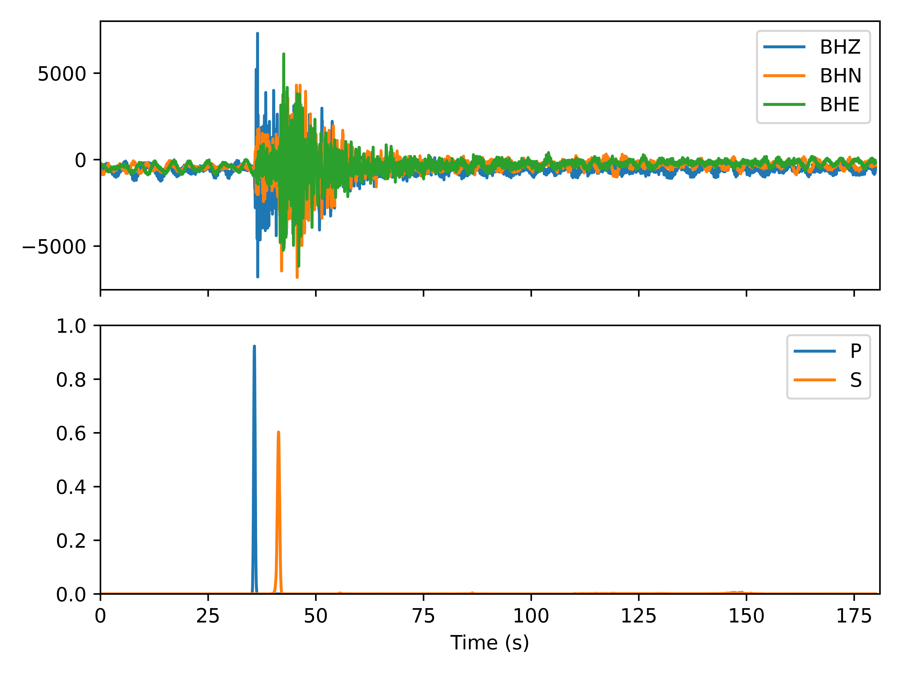

Notes:
1. A major update for this branch is that the PhaseNet model is the same as the original [PhaseNet](https://github.com/AI4EPS/PhaseNet/blob/master/phasenet/model.py) written in TensorFlow (W. Zhu, 2018). The old model (called PhaseNetLight now, see this [PR](https://github.com/seisbench/seisbench/pull/158) for more details) will not be maintained any longer. A comparison between the output of the old and this new model is shown below (The input waveform is from Sichuan province).
2. A minor update for this branch is that we adopt diverse data augmentation techniques when training the China model, including adding Gap, superimposing waveforms with the pure Noise from the [STEAD data set](https://github.com/smousavi05/STEAD), superimposing 2 seismic recordings with a certain offset, dropping 1 or 2 components, clipping, randomly cropping 3001 sample points.
2. This document will be intensely updated before the release of [**seisbench v0.3**](https://github.com/seisbench/seisbench/milestone/1).


# USTC-Pickers: a Unified Set of seismic phase pickers Transfer learned for China

# 1. Install [Anaconda](https://www.anaconda.com/) and requirements

* Create a folder for this project

  ```bash
  mkdir test
  cd test
  ```

* Click this [link](https://github.com/JUNZHU-SEIS/USTC-Pickers/archive/refs/heads/phasenet_fix.zip) to download the 'phasenet_fix' branch of USTC-Pickers. Save it in the folder you just created.


* Click this [link](https://github.com/seisbench/seisbench/archive/refs/heads/phasenet_fix.zip) to download the 'phasenet_fix' branch of seisbench. Save it in the same folder.

* Create an environment and install packages for USTC-Pickers (*Please make sure your conda is the latest version*)

  ```bash
  unzip USTC-Pickers-phasenet_fix.zip
  unzip seisbench-phasenet_fix.zip
  cd seisbench-phasenet_fix
  conda create -n USTC-Pickers
  conda activate USTC-Pickers
  conda install python=3.7
  pip install .
  conda install jupyter
  conda update ipykernel
  cd ../USTC-Pickers-phasenet_fix
  ```

# 2. Transfer-learned pickers
Located in the directory: **USTC-Pickers/model_list/**. Only the model of China ('中国.pt') is provided in this folder, we'll upload the other 40 models very soon.

# 3. Batch prediction

See details in the [Notebook](./demo/demo_pick.ipynb)

# 4. Citation
If you find this toolkit helpful, please cite papers below:

---

* [USTC-Pickers: a Unified Set of seismic phase pickers Transfer learned for China](https://www.equsci.org.cn/en/article/id/95a7e2fc-677e-4879-82a1-bf3b10f945aa)

  _How USTC-Pickers are trained and suggestions on using them in different scenarios._
---

---

* [SeisBench - A Toolbox for Machine Learning in Seismology](https://doi.org/10.1785/0220210324)

  _Reference publication for software._

---

* [Which picker fits my data? A quantitative evaluation of deep learning based seismic pickers](https://doi.org/10.1029/2021JB023499)

  _Example of in-depth bencharking study of deep learning-based picking routines using the SeisBench framework._

---